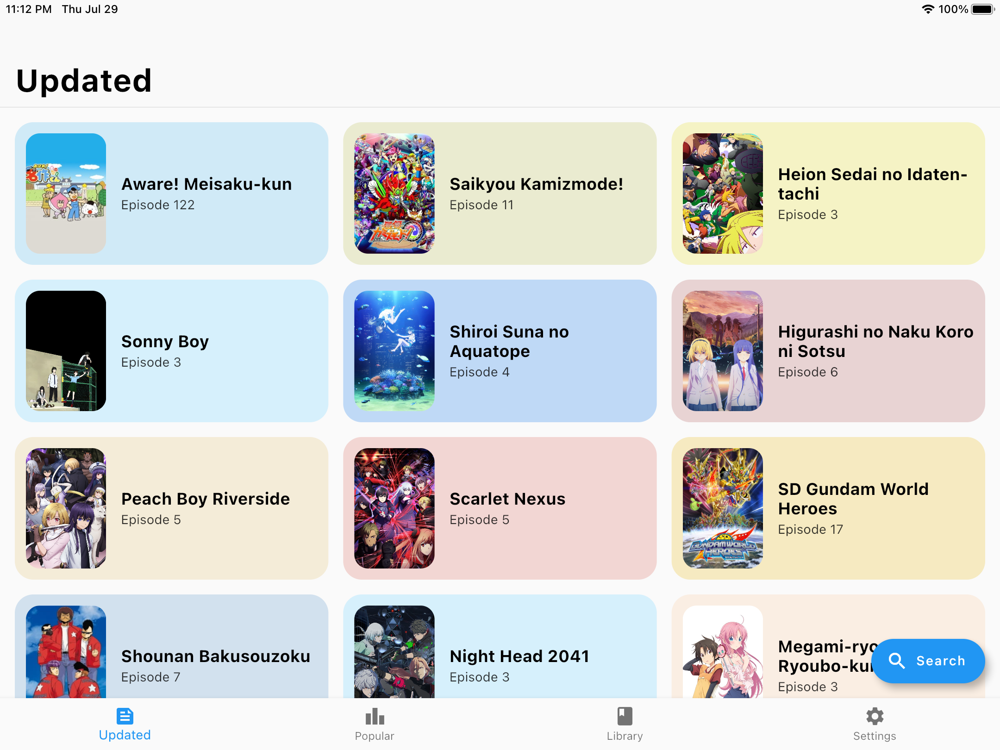
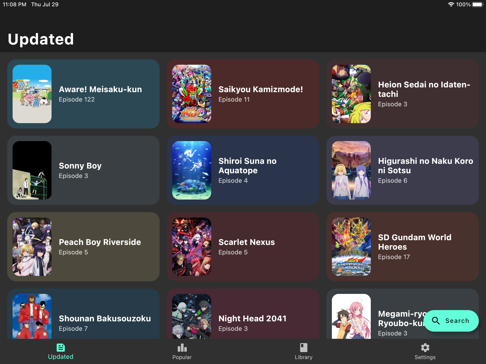
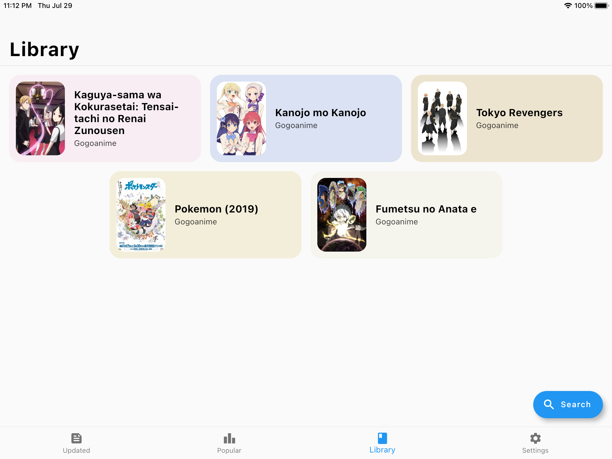
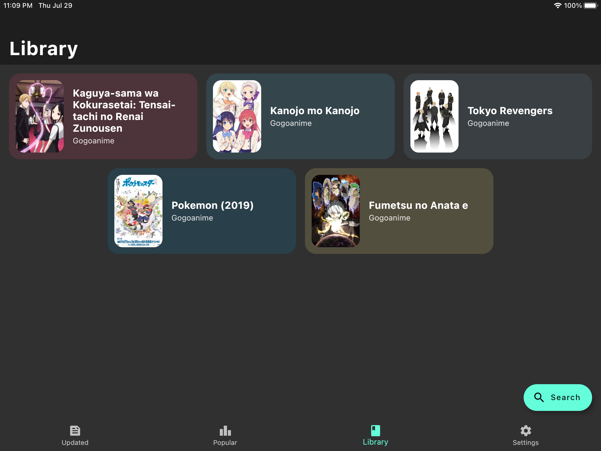
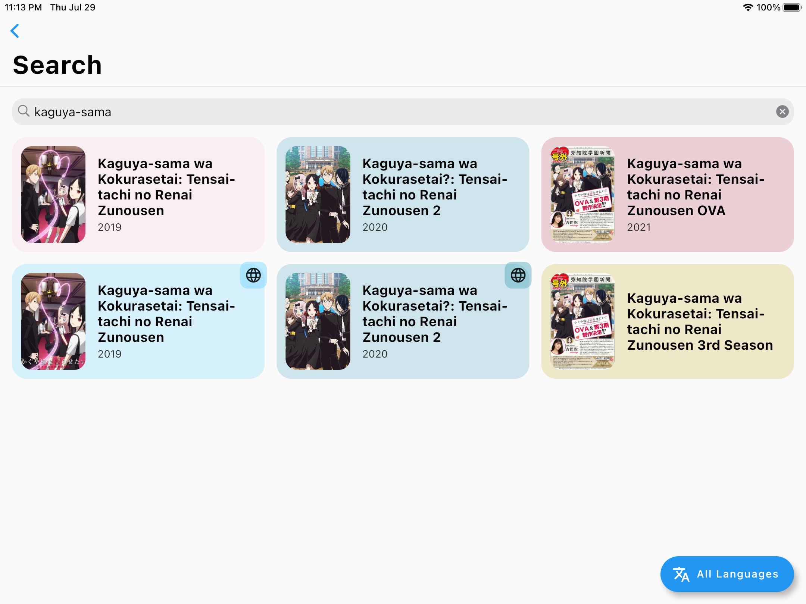
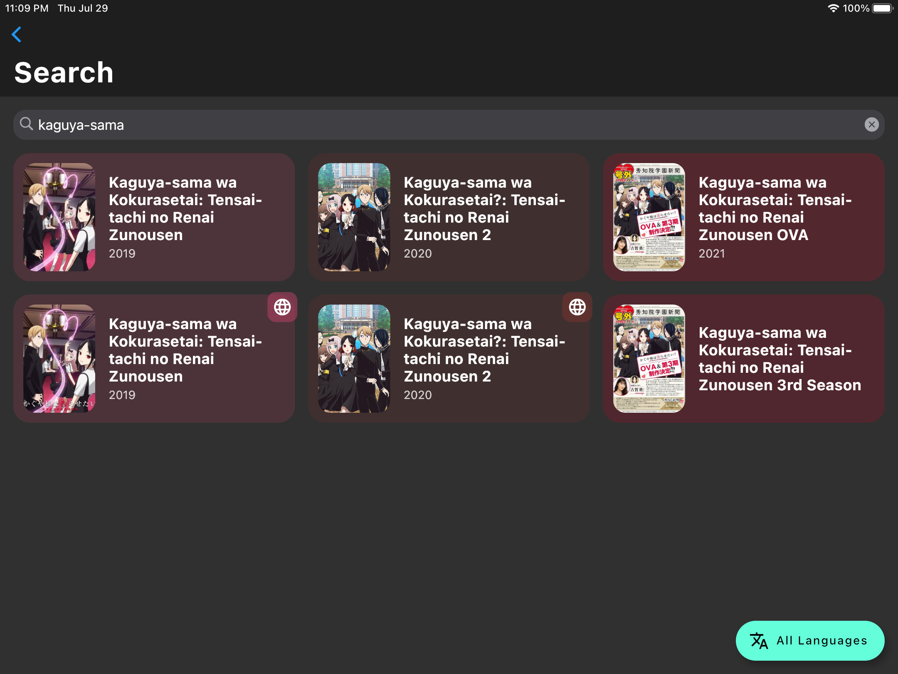
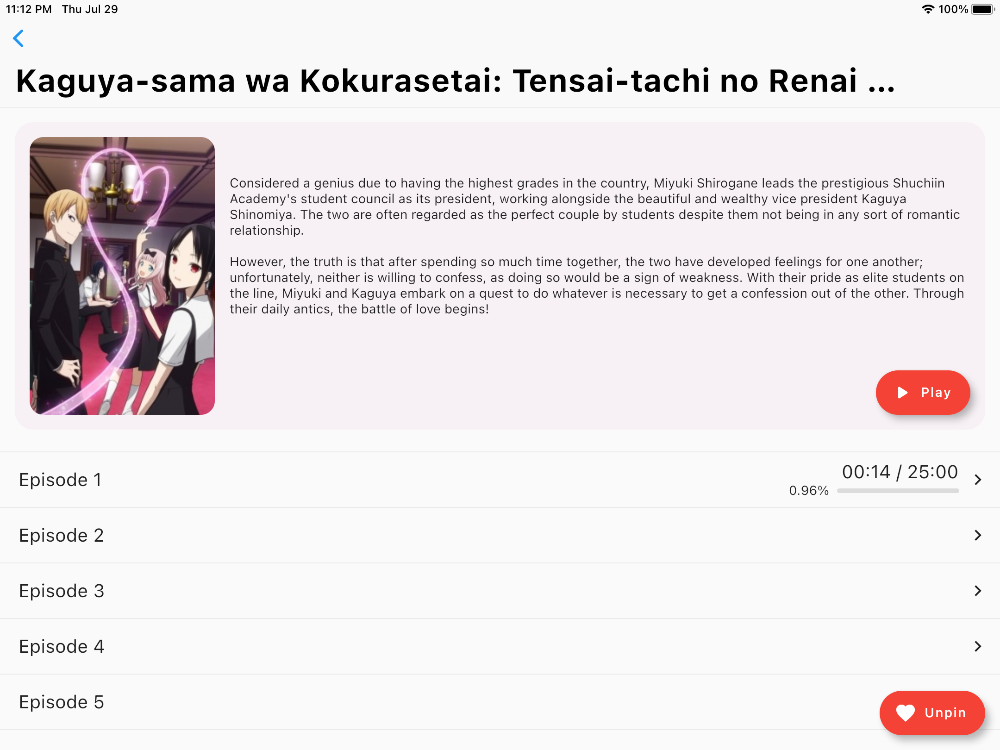
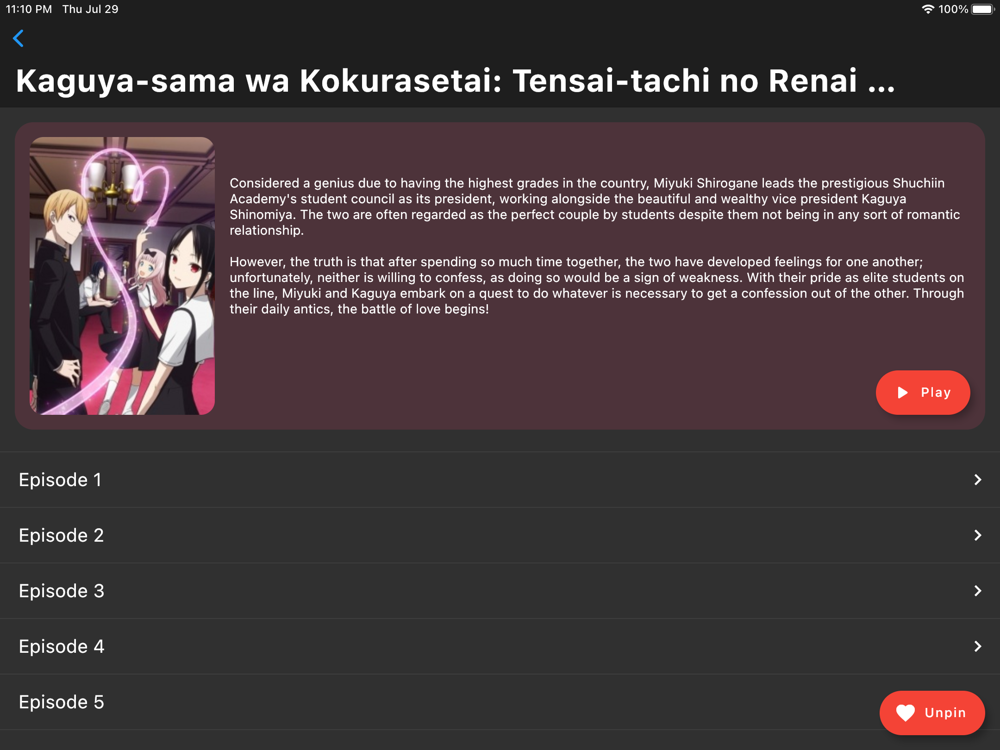
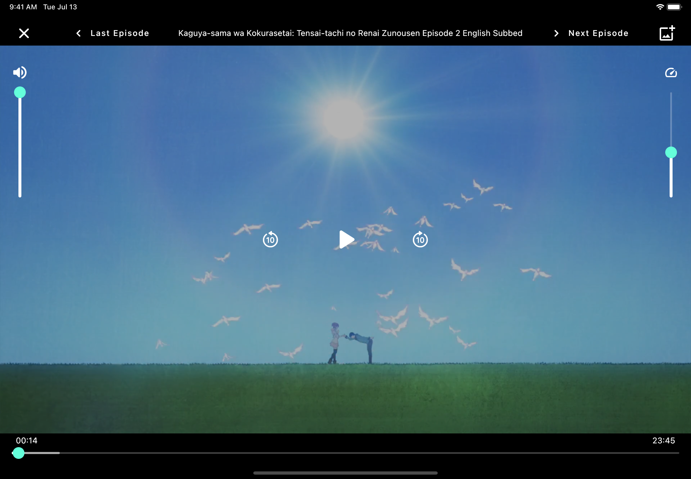
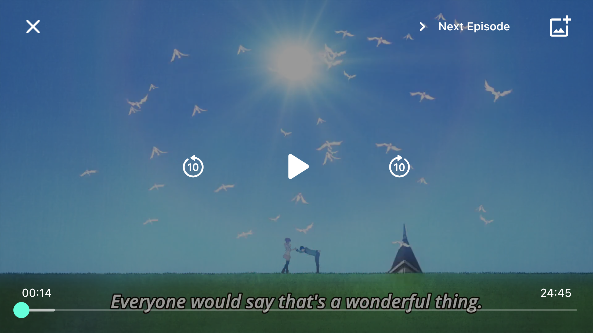

### Watch all your favorite anime shows and movies in one place.

## Table of Contents

1. [Features](#features)
    1. [Video Player Features](#video-player-features)
1. [Screenshots](#screenshots)
1. [Install](#install)
    1. [iOS](#ios)
    1. [Android](#android)
    1. [Windows](#windows-install)
    1. [Apple Silicon Macs](#apple-silicon-macs)
1. [Build](#build)
    1. [Get an IPA File](#to-get-an-ipa-file)
    1. [Windows Application](#to-get-windows-application)
    1. [Compile for Apple Silicon Macs](#to-compile-for-apple-silicon-macs)
1. [Desktop Support](#desktop-support)
   1. [Windows](#windows-notes)
   1. [macOS](#macos)
   1. [Linux](#linux)
1. [Licensing](#licensing)

## Features

- No Ads, Free
- Works on iOS, Android, and Windows (experimental support)
  - Supports phone, tablet, and desktop form factors
- Search shows and read descriptions
- Automatic Progress Saving
- Episode Downloading
- Keyboard Shortcuts
- Scrapes from [GoGoAnime](https://gogoanime.vc/) (more sources to be added)

### Video Player Features

- Skip Openings & Endings (skip by 1:23) by pressing and holding the Skip Forwards 10s button
- Save current frame
- Next and Last Episode buttons
- Volume and Playback Speed controls (iPad and Desktop only)
- Double tap sides to skip 5 seconds
- Double tap center to pause

## Screenshots

### Recently Updated
| Light | Dark |
| ----- | ---- |
|  |  |

### Library
| Light | Dark |
| ----- | ---- |
|  |  |

Shows are added here automatically to keep track of what you are watching. They can be removed with a long press.

### Search
| Light | Dark |
| ----- | ---- |
|  |  |

### Details 
| Light | Dark |
| ----- | ---- |
|  |  |

### Player 
| iPad / Desktop | Phone |
| ------------- | ----- |
|  |  |

## Install

Currently, the app supports iOS, Apple Silicon Macs, and Android, but the Android build may be buggy (see `Android Support` below)

### iOS

Currently, the only way to install without jailbreaking it is through AltStore. TestFlight may come at a later date if
there is funding because the Apple Developer Program is expensive

1. Set Up [AltStore](https://altstore.io/)
2. Download the IPA file from Releases
3. Install the file in AltStore

Drawback: You need to refresh the app every seven days

### Android

Download the APK from Releases and open it 
Allow app to install APKs if asked

<h3 id="windows-install">Windows</h3>

Download the ZIP file from Releases, extract it, and run miru.exe

### Apple Silicon Macs

Because
of Apple's security and my lack of a paid developer license, please compile the application yourself

## Build

To build for iOS or Apple Silicon Macs, you need to have macOS and Xcode set up. To build for Android, you need
the [Android SDK](https://developer.android.com/studio) set up. To build for Windows, you must have [Visual Studios](https://visualstudio.microsoft.com/downloads/) (not VS Code)
installed and set up.

1. Install [Flutter](https://flutter.dev/docs/get-started/install) and git
    - Use `flutter doctor -v` to make sure everything works
2. Clone this repository and enter the directory - `git clone && cd`
3. Get Dependencies with `flutter pub get`
4. Build or Run (use `--release` if necessary)
    - iOS: `flutter build ipa`
    - Android: `flutter build apk`
        - APK File: `build/app/outputs/flutter-apk/app-debug.apk` or `app-release.apk`
   - Windows: `flutter build windows`
   - Run with `flutter run`

### To get an IPA file:

5. Copy `Runner.app` from `build/ios/archive/Runner.xcarchive/Products/Applications` to a folder named `Payload`
6. Compress the Payload folder and change the extension to `.ipa`

### To get Windows application:

5. Go to `build\windows\runner\Release` or `build\windows\runner\Debug`
6. You can copy this folder anywhere

To see packaging options, look at [Flutter's documentation](https://flutter.dev/desktop#windows)

### To compile for Apple Silicon Macs:

5. Open `ios/Runner.xcodeproj` in Xcode
6. Set the scheme to `Runner > My Mac (Designed for iPad)`
7. Press Run
8. When the app opens, ⌘-click the app in the dock to get the Miru.app file
9. Copy Miru.app to /Applications/

## Desktop Support
<h3 id="windows-notes">Windows</h3>
This application supports Windows. However, Flutter's own Windows support is still in beta, so expect bugs!

### macOS
Currently, finding a video player that supports macOS is the biggest challenge, so it remains unsupported.
However, if you have an Apple Sillicon Mac, you can compile the iOS version for your mac [here](#to-compile-for-apple-silicon-macs).

### Linux
Adding Linux support does not seem too difficult since almost all of the dependencies seem to support it,
but I do not have a testing environment set up for it, so this will have to wait.

## Licensing
### Miru is licensed under the terms of the GNU GPLv3 license.
    This program is free software: you can redistribute it and/or modify
    it under the terms of the GNU General Public License as published by
    the Free Software Foundation, either version 3 of the License, or
    (at your option) any later version.

    This program is distributed in the hope that it will be useful,
    but WITHOUT ANY WARRANTY; without even the implied warranty of
    MERCHANTABILITY or FITNESS FOR A PARTICULAR PURPOSE.  See the
    GNU General Public License for more details.

    You should have received a copy of the GNU General Public License
    along with this program.  If not, see <https://www.gnu.org/licenses/>.
