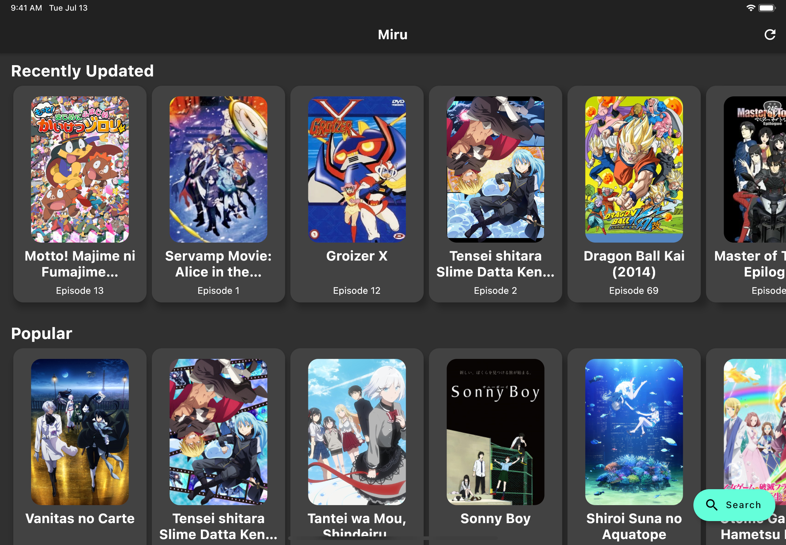
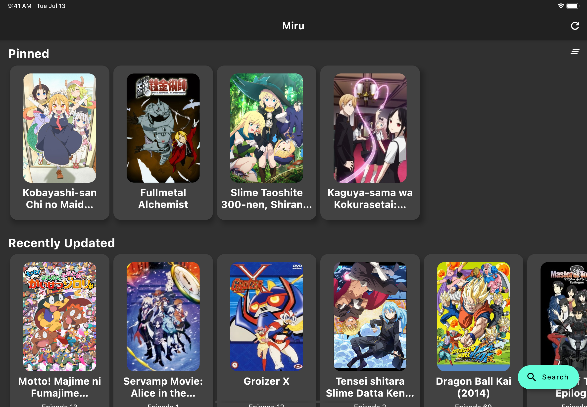
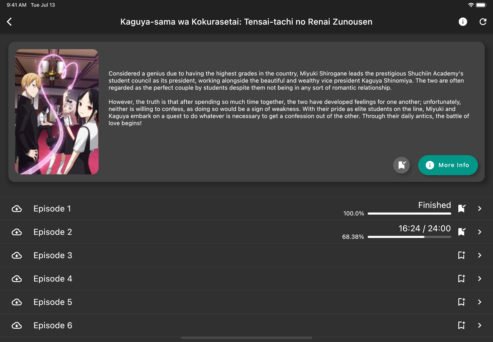
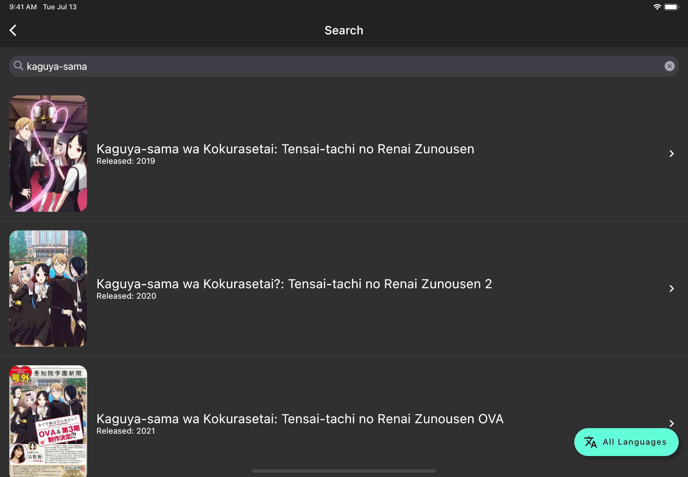

### Watch all your favorite anime shows and movies in one place.

## Features

- No Ads, Free
- Works on iOS, Apple Silicon Macs, and Android (experimentally)
- Episode Downloading
- Search shows and read descriptions
- 

  
Automatic Progress Saving

    - Shows that are pinned are placed at the top of the home screen
    - Episodes that are marked have their progress saved automatically
    - Shows and episodes are automatically pinned as you watch
  

- 
 
  
Fallback Mode (in case IFrame scraping fails)

    - Possible ads (controlled by GoGoAnime/video source, not me!)
    - On iOS, the system video player is used in fullscreen (see Android Support below)
  

- Cached Loading
- Keyboard Shortcuts
- Scrapes from [GoGoAnime](https://gogoanime.vc/)

### Video Player Features

- Skip Openings & Endings (skip by 1:23) by pressing and holding the Skip Forwards 10s button
- The Save Frame Button (top right) saves the current frame and opens the share menu
- Next and Last Episode buttons
- Volume and Playback Speed controls
- Double tap sides to skip 5 seconds, double tap center to pause

## Screenshots

| Home | Home w/ Pin |
| ---- | ---- |
|  |  |

| Details | Search |
| ---- | ---- |
|  |  |

| Video Player |
| ---- |
|  |

## Install

Currently, the app supports iOS, Apple Silicon Macs, and Android, but the Android build may be buggy (see `Android Support` below)

### iOS

Currently, the only way to install without jailbreaking it is through AltStore. TestFlight may come at a later date if
there is funding because the Apple Developer Program is expensive

1. Set Up [AltStore](https://altstore.io/)
2. Download the IPA file from Releases
3. Install the file in AltStore

Drawback: You need to refresh the app every seven days

### Android

Download the APK from Releases and open it 
Allow app to install APKs if asked

### Apple Silicon Macs

Because
of Apple's security and my lack of a paid developer license, please compile the application yourself

## Build

To build for iOS or Apple Silicon Macs, you need to have macOS and Xcode. To build for Android, you need
the [Android SDK](https://developer.android.com/studio).

1. Install [Flutter](https://flutter.dev/docs/get-started/install)
    - Use `flutter doctor -v` to make sure everything works
2. Clone this repository and enter the directory - `git clone && cd`
3. Get Dependencies with `flutter pub get`
4. Build or Run (use `--release` if necessary)
    - iOS: `flutter build ipa`
    - Android: `flutter build apk`
        - APK File: `build/app/outputs/flutter-apk/app-debug.apk` or `app-release.apk`
    - Run with `flutter run`

### To get an IPA file:

5. Copy `Runner.app` from `build/ios/archive/Runner.xcarchive/Products/Applications` to a folder named `Payload`
6. Compress the Payload folder and change the extension to `.ipa`

### To compile for Apple Silicon Macs:

5. Open `ios/Runner.xcodeproj` in Xcode
6. Set the scheme to `Runner > My Mac (Designed for iPad)`
7. Press Run
8. When the app opens, ⌘-click the app in the dock to get the Miru.app file
9. Copy Miru.app to /Applications/

## Android Notes

While this application compiles for Android, many of its features are untested. Here are some things to look out for:

- A page may buffer forever (usually fixable with the reload button)
- Fallback Mode's ads are harder to avoid since:
    1. Fullscreen is not entered automatically
    2. The player is the IFrame's player, even in fullscreen
    
## Apple Silicon Mac Notes

The only issue that I have noticed that is unique to Apple Silicon Macs is finicky persistent storage

## Resources

- Dart v2.13.4
- Flutter v2.2.3

### Pub Packages
- flutter_inappwebview v5.3.2
- video_player v2.1.6
- video_thumbnail v0.3.3
- path_provider v2.0.2
- share v2.0.4
- shared_preferences v2.0.6
- dio v4.0.0
- flutter_animation_progress_bar v2.0.0
- wakelock v0.5.2
- flutter_xlider v3.5.0

## Licensing
### Miru is licensed under the terms of the GNU GPLv3 license.
    This program is free software: you can redistribute it and/or modify
    it under the terms of the GNU General Public License as published by
    the Free Software Foundation, either version 3 of the License, or
    (at your option) any later version.

    This program is distributed in the hope that it will be useful,
    but WITHOUT ANY WARRANTY; without even the implied warranty of
    MERCHANTABILITY or FITNESS FOR A PARTICULAR PURPOSE.  See the
    GNU General Public License for more details.

    You should have received a copy of the GNU General Public License
    along with this program.  If not, see <https://www.gnu.org/licenses/>.
